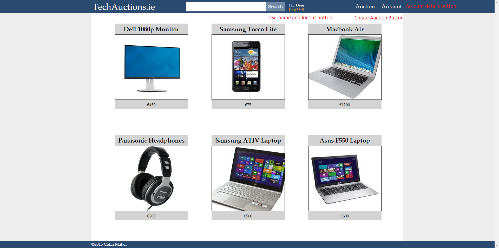
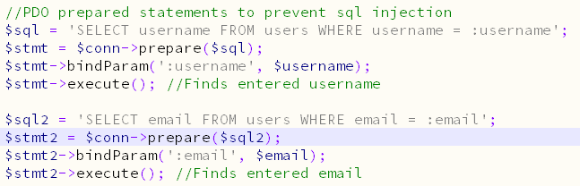
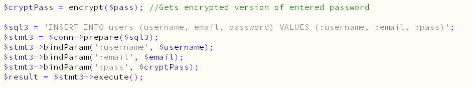
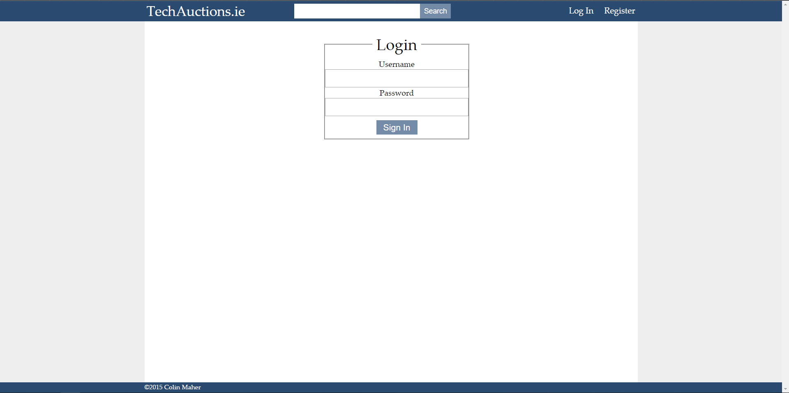
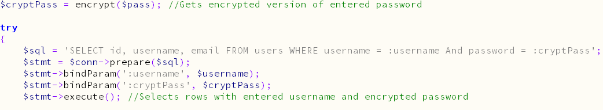
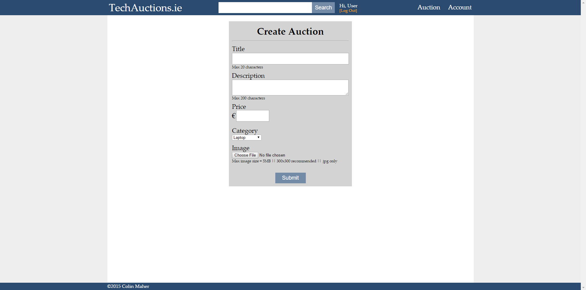
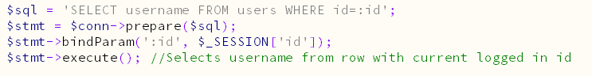
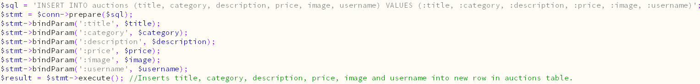

# tech-auctions
Auctions web project written in PHP. Completed in 2015. 

Index.php
The homepage is very straight forward. 

When you log in the header changes. The code for the header is located in includes/header.php

register.php
You can register here. The Javascript function validatePassword() is used to make sure password and confirm password are the same before submitting the form. 

registerScript.php
The code in this file processes the information sent from register.php. 
These prepared statements select rows from user table where the username or email is equal to entered username or email. 
If there are any rows containing either this username or email the user is asked to enter another. 

This encrypts the entered password using Salt. The the prepared statement enters the information into a new row in the users table. 
The encrypted password is stored in the table so that if the database was hacked, the hackers still could not access any users accounts.

login.php
You can login here with your username and password. 

loginScript.php
When a user tries to login the entered password is encrypted and compared to the password in the database. This prepared statement selects id, username and email from whichever row contains both the entered username and encrypted password.

auction.php
An auction can be created on the auction page

auctionScript.php
The first half of this file is code for evaluating the image. It sets the directory for saving, It makes sure it is under 5MB, it makes sure it’s extension is .jpg and it gives it a name including the id, title and date to prevent overwriting other images with the same name. 
This prepared statement gets the the users username so the username can be added to auctions table.

This prepared statement inserts all the information into the auctions table. The image url is saved so it can be concatenated into html. 

account.php
Your account info can be edited on the account page. Press the edit button to unlock the fields. The Javascript function validatePassword() is used to make sure password and confirm password are the same before submitting the form. This page uses while loops to display all the information from the $row arrays. 
If you are logged in as admin this page changes to a control panel, where you can view all accounts.

